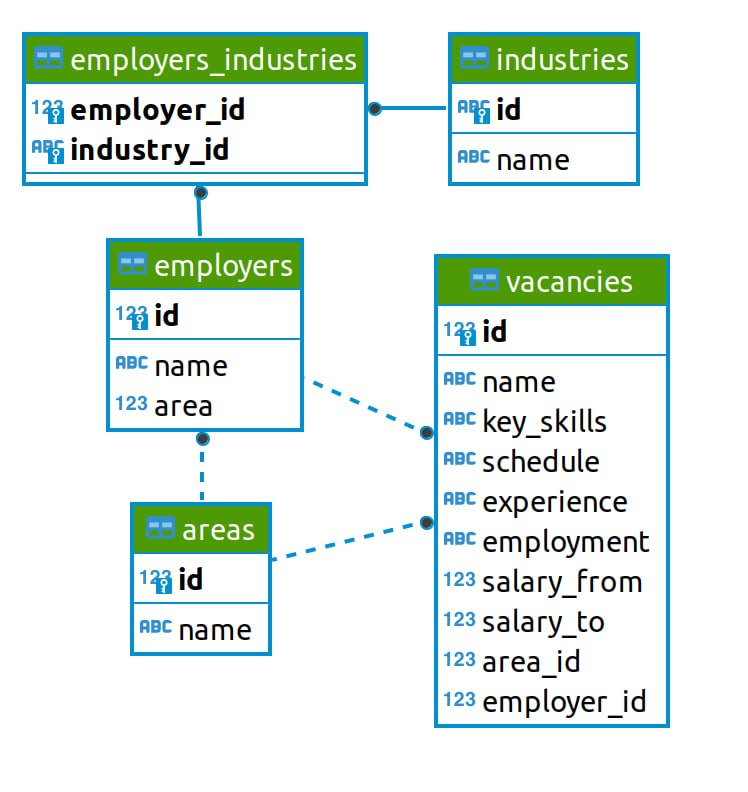

# <center> Проект 2. Анализ вакансий из HeadHunter </center>
## Оглавление
1. [Описание проекта](#Описание-проекта)
2. [Описание данных](#Описание-данных)
3. [Зависимости](#Используемые-зависимости)
4. [Установка проекта](#Установка-проекта)
5. [Использование проекта](#Использование)

## Описание проекта

Цель данного проекта - анализ данных компании интернет-рекрутмента HeadHunter в целях дальнейшего подбора вакансий на позицию Data Scientist. Получение представления о данных и проверка их на соответствие заявленной выше цели.

**Основные этапы проекта:**
* Знакомство с данными
* Предварительный анализ данных
* Детальный анализ данных
* Анализ работодателей
* Предметный анализ
* Дополнительные исследования данных

**О структуре проекта:**

* [PROJECT-2. Анализ вакансий из HeadHunter.ipynb](./PROJECT-2.%20Анализ%20вакансий%20из%20HeadHunter.ipynb) - jupyter-ноутбук, содержащий основной код проекта, в котором демонстрируется последовательные действия по анализу данных.
* [images](./images) - jupyter-ноутбук, содержащий основной код проекта, в котором демонстрируется последовательные действия по анализу данных.


## Описание данных




Данные представлены пятью взаимосвязанными таблицами:
* **vacances** - хранит в себе данные по вакансиям.
* **areas** - таблица-справочник, которая хранит код города и его название.
* **employers** - таблица-справочник со списком работодателей
* industries - таблица-спровочник вариантов сфер деятельности работодателей.
* **employers_industries** - дополнительная таблица, которая существует для организации связи между работодателями и сферами деятельности.

## Используемые зависимости
* Python (3.9):
    * [pandas (1.4.2)](https://pandas.pydata.org)
    * [psycopg2 (2.9.5)](https://www.psycopg.org)
    * [requests (2.27.1)](https://requests.readthedocs.io/en/latest/)
    * [BeautifulSoup (4.8.1)](https://beautiful-soup-4.readthedocs.io/en/latest/)

## Установка проекта

```
git clone https://github.com/Vsevolod90/Data_Science_Projects/PROJECT-2.%20Анализ%20вакансий%20из%20HeadHunter
```

## Использование
Вся информация о работе представлена в [jupyter-ноутбуке PROJECT-2. Анализ вакансий из HeadHunter](./PROJECT-2.%20Анализ%20вакансий%20из%20HeadHunter.ipynb)
